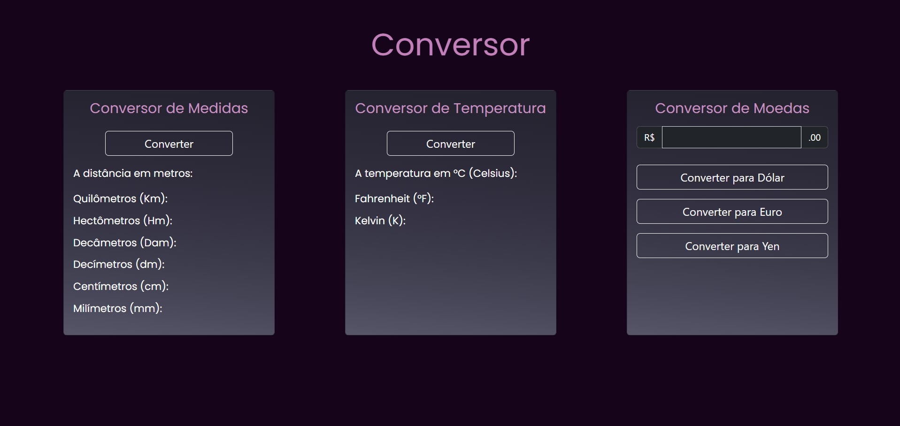
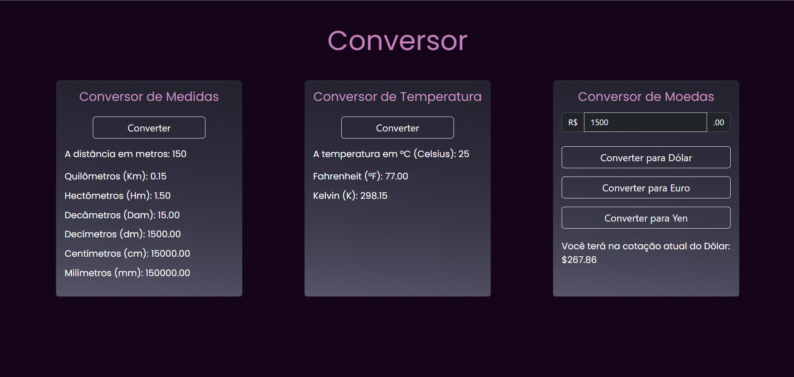

# Conversor

Este projeto permite realizar conversões de medidas, temperaturas e moedas, desenvolvido com HTML, CSS, JavaScript e Bootstrap.

# Funcionalidades

### Conversor de Medidas

Insira um valor em metros para convertê-lo nas seguintes unidades:

* Quilômetros (Km)
* Hectômetros (Hm)
* Decâmetros (Dam)
* Decímetros (dm)
* Centímetros (cm)
* Milímetros (mm)
  
### Conversor de Temperatura

Converta temperaturas de Celsius (°C) para:

* Fahrenheit (°F)
* Kelvin (K)
  
### Conversor de Moedas

Converta valores de Real (R$) para:

* Dólar (USD)
* Euro (EUR)
* Yen (JPY)
  
# Tecnologias Utilizadas

* HTML
* CSS
* Bootstrap
* JavaScript
  
## Como Usar

* Medidas: Clique no botão Converter. Um pop-up será aberto onde você deve inserir o valor em metros e clicar em OK. O resultado será exibido em várias unidades de medida, como quilômetros, hectômetros, decímetros, etc.
* Temperatura: Clique no botão Converter. Um pop-up será aberto onde você deve inserir a temperatura em Celsius e clicar em OK. O resultado será exibido em Fahrenheit e Kelvin.
* Moedas: Insira o valor em Real (R$) no campo correspondente, depois escolha o botão da moeda para a qual deseja converter (Dólar, Euro ou Yen).Um pop-up será aberto para você inserir a cotação atual da moeda escolhida, depois clique em OK para obter o valor convertido.

